# Install JHipster 

JHipster 를 이용하기 위해서는 다음과 같은 툴킷을 설처 히애한다. 

- Java
- Git
- Node.js

## Java 설치. 

- Java 설치를 위해서는 SDKMan 을 설치하는 것을 추천한다. 
- SDKMan 을 이용하면 필요시 SDK 버젼을 변경하면서 사용할 수 있기 때문에 실행시 유연성을 얻을 수 있다. 
- SDKMan 설치 관련 [아티클](https://schooldevops.github.io/tools/2021/05/25/sdkman/) 참조. 

여기서는 Open JDK 11 버젼을 이용했다. 

```go
java --version

openjdk 11.0.10 2021-01-19
OpenJDK Runtime Environment AdoptOpenJDK (build 11.0.10+9)
OpenJDK 64-Bit Server VM AdoptOpenJDK (build 11.0.10+9, mixed mode)
```

## Git 설치하기. 

- Mac 에서 테스트를 한다고 가정하고, brew 를 이용하여 Git 을 설치한다. 

```go
brew install git

...
==> Summary
🍺  /usr/local/Cellar/git/2.32.0: 1,517 files, 42.0MB
Removing: /usr/local/Cellar/git/2.30.1... (1,487 files, 40.5MB)
```

```go
git --version
git version 2.32.0
```

git 도 정상으로 설치 되었다. 

## Node.js 

- 가장 중요한 Node JS 를 설치하자. 
- [Node Download](https://nodejs.org/ko/download/) 사이트에서 다운 받는다. 
- 다운 받은 Node JS 를 실행하고, 확인해보자. 

```go
node --version
v14.17.0
```

```go
npm --version
7.14.0
```

## JHipster 설치하기. 

- node 까지 생성했다면 이제는 JHipster를 설치해야한다. 

### JHipster 개요

- JHipster 는 우선 현대 웹 어플리케이션과 마이크로 서비스 아키텍처 프레임워크를 생성할 수 있는 플랫폼이다. 
- [yeoman](https://yeoman.io/) 이라는 툴을 이용하여, SpringBoot Template을 자동으로 구성하고 생성해 준다. 
  - 설명 페이지에서 이야기 하는 것처럼 Scaffolding 도구이다. 
  - 이 의미는 yoeman generator 를 등록해서 어떠한 프로젝트 도구든지 개발을 위한 프레임워크를 자동화 해서 생성해주는 역할을 한다는 것이다. 
  - JHipster는 다양한 기술 (스프링 시큐리티, 웹, 데이터베이스 연동, 국제화, JPA, 테스트코드, 프런트엔드 툴 등) 들을 연동하여 하나의 개발 템플릿 (Scaffolding) 을 생성하도록 하고 있다. 
  - 다양한 generator 를 Yeoman 사이트 [Generator](https://yeoman.io/generators/) 탭에서 확인할 수 있다. 

### JHipster 설치

```go
npm install -g generator-jhipster
```

```go
jhipster --version
INFO! Using JHipster version installed globally
7.1.0
```

위와 같이 설치 버젼을 확인했다. 7.1.0 이 설치된 것을 확인할 수 있다. 

## JHipster 프로젝트 생성하기. 

- 이제 JHipster 프로젝트를 생성해 보자. 

```go
mkdir sample
cd sample
jhipster
```

### Application Type 선택하기. 

아래와 같이 어플리케이션 타입을 선택하는 화면이 나온다. 

- 어플리케이션 타입
  - Monolithic application: 모놀리식 어플리케이션으로, 단순 프로젝트에서 유용하다. 
  - Gateway application: 게이트웨이는 마이크로 서비스 아키텍처에서 Gateway 를 이용하도록 한다. Netflix OOS 를 기본으로 이용한다. 
  - Microservice application: 마이크로 서비스를 개발할 수 있도록 프로젝트를 생성한다. 

우리는 Monolithic application 을 이용할 것이다. 

```
INFO! Using JHipster version installed globally


        ██╗ ██╗   ██╗ ████████╗ ███████╗   ██████╗ ████████╗ ████████╗ ███████╗
        ██║ ██║   ██║ ╚══██╔══╝ ██╔═══██╗ ██╔════╝ ╚══██╔══╝ ██╔═════╝ ██╔═══██╗
        ██║ ████████║    ██║    ███████╔╝ ╚█████╗     ██║    ██████╗   ███████╔╝
  ██╗   ██║ ██╔═══██║    ██║    ██╔════╝   ╚═══██╗    ██║    ██╔═══╝   ██╔══██║
  ╚██████╔╝ ██║   ██║ ████████╗ ██║       ██████╔╝    ██║    ████████╗ ██║  ╚██╗
   ╚═════╝  ╚═╝   ╚═╝ ╚═══════╝ ╚═╝       ╚═════╝     ╚═╝    ╚═══════╝ ╚═╝   ╚═╝

                            https://www.jhipster.tech

Welcome to JHipster v7.1.0
Application files will be generated in folder: /Users/kido/Documents/06.PROGRAMMING_COURSES/jhipster/jhipste_tutorials/sample
 _______________________________________________________________________________________________________________

  Documentation for creating an application is at https://www.jhipster.tech/creating-an-app/
  If you find JHipster useful, consider sponsoring the project at https://opencollective.com/generator-jhipster
 _______________________________________________________________________________________________________________

? Which *type* of application would you like to create? (Use arrow keys)
❯ Monolithic application (recommended for simple projects) 
  Gateway application 
  Microservice application 
```

### 어플리케이션 이름 

```go
What is the base name of your application? (sample) 
```

어플리케이션 이름을 작성한다. 여기서는 sample로 지정하자. 

### WebFlux 적용 여부 

```go
Do you want to make it reactive with Spring WebFlux? (y/N)
```

웹 플럭스를 사용할지 지정한다. 

일반 웹 어플리케이션이라면 N을 선택하고, 리액티브 프로그래밍으로 서비스를 하고 싶다면 Y를 선택한다. 

우리는 N으로 지정하였다. 

### 자바 베이스 패키지 지정하기. 

```go
What is your default Java package name? (com.mycompany.myapp)
```

이제는 기본 패키지를 지정한다. 추천은 (com.mycompany.myapp) 으로 되어 있다. 

즉, com.schooldevops.sampleapp 으로 지정해보자. 

### Security 타입 설정하기. 

```go
? Which *type* of authentication would you like to use? (Use arrow keys)
❯ JWT authentication (stateless, with a token) 
  OAuth 2.0 / OIDC Authentication (stateful, works with Keycloak and Okta) 
  HTTP Session Authentication (stateful, default Spring Security mechanism) 
```

이제는 인증 타입을 지정해보자. 

- 인증 타입: 
  - JWT authentication: 대표적인 stateless 형 인증이다. JWT는 단순한 구조이면서도, 페이로드에 필요한 정보를 이용할 수 있어서 인기가 많다. 
  - OAuth 2.0 / OIDC Authentication: OAuth 2.0 은 산업 표준 인증 프로토콜이며, 클라이언트가 쉽게 인증을 수행하면서도, 웹 어플리케이션을 위한 정형화된 인증 메커니즘을 제공한다. OIDC는 (Open ID Connect) 로 OAuth 2.0 을 베이스로 클라이언트에서 인증을 수행할 수 있는 규격을 제공한다.  
  - HTTP Session Authentication: HTTP Session 을 기반으로 인증을 수행한다. 

여기서는 JWT 인증을 이용할 것이다. 기본적으로 JHipster는 SpringSecurity 를 수행해야하 한다. 

### Database 타입 지정하기. 

```go
? Which *type* of database would you like to use? (Use arrow keys)
❯ SQL (H2, PostgreSQL, MySQL, MariaDB, Oracle, MSSQL) 
  MongoDB 
  Cassandra 
  [BETA] Neo4j 
  No database 
```

데이터 베이스 타입을 지정한다. 

- DataBase 타입
  - SQL (H2, PostgreSQL, MySQL, MariaDB, Oracle, MSSQL): 이와 같이 관계형 데이터베이스를 연동할때 사용한다. 
  - MongoDB: Document Base NoSQL 의 대표 데이터베이스인 MongoDB 연동을 지원한다. 
  - Cassandra: 확장성이 뛰어난 NoSQL 인 카산드라 연동을 지원한다. 
  - Neo4j: 베타로 제공하며, Graph Database 이다. 관계등을 표현할때 매우 훌륭한 NoSQL 이다. 
  - No database: 데이터베이스 제공이 없을때 사용한다. 

여기서는 관계형 데이터베이스를 이용할 것이기 때문에 SQL 을 선택한다. 

### 프로덕션용 데이터베이스 지정하기. 

```go
? Which *production* database would you like to use? (Use arrow keys)
  PostgreSQL 
  MySQL 
❯ MariaDB 
  Oracle 
  Microsoft SQL Server 
```

실제 프로덕션용 데이터베이스를 선택한다. 여기서는 MariaDB를 선택했다. 

이를 선택하면 DataSource 연동을 위해 각 DB 커넥션 의존성 라이브러리가 추가된다. 

### 개발용 데이터베이스 선택하기. 

```go
? Which *development* database would you like to use? (Use arrow keys)
  H2 with disk-based persistence 
  H2 with in-memory persistence 
❯ MariaDB 
```

위와 같이 개발용 데이터베이스를 선택할 수 있다. 

개발 환경에서는 보통 H2를 이용하거나, 개발 환경의 데이터베이스로 사용을 하게 된다. 

만약 공용 개발환경을 위해서라면  MariaDB(이는 프로덕션 선택을 따라간다.) 를 선택하자. 

### Cache 설정하기. 

```go
? Which cache do you want to use? (Spring cache abstraction) (Use arrow keys)
❯ Ehcache (local cache, for a single node) 
  Caffeine (local cache, for a single node) 
  Hazelcast (distributed cache, for multiple nodes, supports rate-limiting for gateway applications) 
  Infinispan (hybrid cache, for multiple nodes) 
  Memcached (distributed cache) - Warning, when using an SQL database, this will disable the Hibernate 2nd level cache! 
  Redis (distributed cache) 
  No cache - Warning, when using an SQL database, this will disable the Hibernate 2nd level cache! 
```

캐시는 히트 율이 높은 데이터를 저장해 두고, 요청시마다 캐시에서 데이터를 가져가도록 하여 성능을 개선하는데 사용한다. 

위와 같이 캐시타입을 선택하 ㄹ수 있다. 

- Cache 타입
  - Ehcache: 대표적인 로컬 캐시로 사용이 쉽다. 
  - Caffeine: Ehcache와 마찬가지로 로컬 캐시용으로 사용한다. 
  - Hazelcast: 분산 캐시를 이용하며, 어플리케이션에서 캐시 데이터를 저장하고, 이를 여러개의 어플리케이션에서 분산 저장하는 캐시이다. 데이터를 안전하게 분산하면서도, 동기화를 함께 진행하여 로컬 캐시보다는 안정적으로 캐싱을 수행할 수 있다. 
  - Infinispan: 분산 캐시이며, 여러 노드들에 캐시를 저장하는 대표적인 캐시이다. 
  - Memcached: 분산 캐시이며, 키/값 쌍의 형태 데이터를 캐시하는데 적합하며, 성능이 매우 좋다. 위 설명처럼 하이버네이트 2차 캐시를 동작시키면, Mencached 는 무시된다
  - Redis: 대표적인 분산 캐시로, 다양한 자료구조를 제공하는 다용도 캐시이다. 
  - No cache: 캐시를 사용하지 않는다. (일반적으로 잘 이용하지 않는다.)

우리는 여기서 Ehcache 를 이용할 것이다. 

### Hibernate 2차 캐시 사용 여부 

```go
? Do you want to use Hibernate 2nd level cache? (Y/n)
```

하이버네이트는 쿼리 성능 향상을 위해서 2차 캐시를 이용하여, 조회한 데이터를 캐싱한다. 

여기서는 활성화 하자. 

### 의존성 관리 도구 설정 

```go
? Would you like to use Maven or Gradle for building the backend? (Use arrow keys)
❯ Maven 
  Gradle 
```

대표적인 의존성 관리도구인 Maven, Gradle 중 선택할 수 있다. 

선호하는 툴을 선택하자. 

### jHipster Registry 설정여부

```go
? Do you want to use the JHipster Registry to configure, monitor and scale your application? (Use arrow keys)
❯ No 
  Yes 
```

jHipster Registry 설정을 선택한다. 

jHipster Registry 는 Eureka 를 기본으로 사용하며, 서비스를 등록하고, 이들의 모니터링을 수행하도록 해준다. 

즉, Eureka Service Discovery, Spring Cloud Config, Monitoring Dashboard 등을 제공한다. 

여기서는 No 를 선택한다. 

### 기타 기술 선택하기. 

```go
? Which other technologies would you like to use? (Press <space> to select, <a> to toggle all, <i> to invert selection)
❯◯ Elasticsearch as search engine
 ◯ WebSockets using Spring Websocket
 ◯ Apache Kafka as asynchronous messages broker
 ◯ API first development using OpenAPI-generator
```

jHipster는 기본적으로 제공되는것 이외에도 기타 기술들을 추가할 수 있다. 

- Elasticsearch 검색엔진
- 웹소켓
- Kafak
- OpenAPI

위와 같은 추가 기술들을 제공하고 있다. 

여기서는 별도 선택없이 그냥 넘어간다. 선택하고자 한다면 "space" 를 클릭하면 선택이 된다. 

### Front 기술 설정하기. 

```go
? Which *Framework* would you like to use for the client? 
  Angular 
  React 
❯ Vue 
  No client 
```

이제 프런트엔드 프레임워크를 선택한다. 

Vue 를 선택하자.

### Admin UI 사용하기 

```go
? Do you want to generate the admin UI? (Y/n) 
```

기본적으로 jHipster는 어드민 화면을 제공한다. 

이에 Admin UI 를 사용할지 선택하자. 여기서는 'Y'로 UI 를 사용하겠다고 하자. 

### Admin UI Theme 선택하기. 

```go
? Would you like to use a Bootswatch theme (https://bootswatch.com/)? (Use arrow keys)
❯ Default JHipster 
  Cerulean 
  Cosmo 
  Cyborg 
  Darkly 
  Flatly 
  Journal 
(Move up and down to reveal more choices)
```

jHipster는 Bootstrap 프레임워크를 이용한다. 

https://bootswatch.com 에서 부트스트랩 테마를 제공하고 있으며, 화면에서 보고 선택하면 된다. 

여기서는 기본 테마를 선택하였다. 

### 국제화 선택하기.

```go
 Would you like to enable internationalization support? (Y/n) 
```

국제화 지원여부 여기서는 'Y' 를 선택하자. 

### 대표 언어 선택하기. 

```go
? Please choose the native language of the application (Use arrow keys)
❯ Korean 
  Marathi 
  Myanmar 
  Polish 
  Portuguese (Brazilian) 
  Portuguese 
  Romanian 
(Move up and down to reveal more choices)
```

대표 언어는 Korean 이므로 그대로 다음으로 넘어간다. 

### 추가 언어 지원 선택하기. 

```go
? Please choose additional languages to install (Press <space> to select, <a> to toggle all, <i> to invert selection)
❯◯ Albanian
 ◯ Arabic (Libya)
 ◯ Armenian
 ◯ Belarusian
 ◯ Bengali
 ◯ Bulgarian
 ◯ Catalan
```

추가적인 언어를 선택한다. 

추가적인 언어는 나열된 언어를 선택할 수 있으나 여기서는 그냥 넘어간다. 

### 테스트 프레임워크 선택하기. 

```go
? Besides JUnit and Jest, which testing frameworks would you like to use? (Press <space> to select, <a> to toggle all, <i> to in
vert selection)
❯◯ Cypress
 ◯ [DEPRECATED] Protractor
 ◯ Gatling
 ◯ Cucumber
```

Junit, Jest 이외에 사용할 테스트 프레임워크를 선택할 수 있다. 

- 테스트 프레임워크
  - Cypress: javascript 테스트 프레임워크이다. 
  - Gatling: 오픈소스 로드 테스트용 테스트 프레임워크이다. 
  - Cucumber: BDD(Behavor Driven Develpment)를 수행하느 대표적인 테스트 프레임워크이다. 

여기서는 아무것도 선택하지 않고 넘어가자. 

### jHipster Marketplace 에서 선택하기

```go
? Would you like to install other generators from the JHipster Marketplace? (y/N)
```

위와 같이 JHipster Marketplace 로 부터 다른 generator를 설치할 수 있다. 

여기서는 N 으로 그냥 넘어간다. 


## 실행하기. 

위 설정이 모두 끝났다면 프로젝트가 정상적으로 생성될 것이다. 

생성되는 파일이 매우 많지만 자세한 내용은 천천히 알아보고 우선 실행해 보자. 

###  서버 실행하기. 

서버를 우선 실행 해보자. 

우리는 maven 을 선택했으므로 ./mvnw 파일을 확인해 볼 수 있다. 

```go
./mvnw
```

위 명령을 수행하면 다음과 같은 일이 일어난다. 

1. maven dependency 다운로드 
2. 프로젝트 빌드
3. webpack 의존성 다운로드
4. 소스 컴파일 빌드
5. spring boot 실행하기. 


### 실행 오류 확인하기. 

위 과정에서 오류를 확인할 수 있다. 

```go
2021-07-19 15:14:35.973 ERROR 13170 --- [  restartedMain] o.s.boot.SpringApplication               : Application run failed

org.springframework.beans.factory.BeanCreationException: Error creating bean with name 'entityManagerFactory' defined in class path resource [org/springframework/boot/autoconfigure/orm/jpa/HibernateJpaConfiguration.class]: Invocation of init method failed; nested exception is org.hibernate.service.spi.ServiceException: Unable to create requested service [org.hibernate.engine.jdbc.env.spi.JdbcEnvironment]
        at org.springframework.beans.factory.support.AbstractAutowireCapableBeanFactory.initializeBean(AbstractAutowireCapableBeanFactory.java:1786)
        at org.springframework.beans.factory.support.AbstractAutowireCapableBeanFactory.doCreateBean(AbstractAutowireCapableBeanFac

... 생략

Caused by: org.hibernate.service.spi.ServiceException: Unable to create requested service [org.hibernate.engine.jdbc.env.spi.JdbcEnvironment]

... 생략
```

관련 내용을 확인해보면 org.hibernate.engine.jdbc.env.spi.JdbcEnvironment 에 이슈가 있음을 알 수 있다. 

그리고 Unable to create requested service ... 역시 확인할 수 있다. 

**오류 원인**

위 오류는 우리가 jHipster를 생성할때 개발 개발용 데이터베이스를 실제 MariaDB로 생성했기 때문이다. 

즉 Local 에 접근할 수 있는 MySQL 이 존재하지 않기 때문에 발생한 오류이다. 

### MySQL 실행하기. 

이제는 Docker를 이용하여 MySQL 을 실행해 보자. 

```go
docker run -p 127.0.0.1:3306:3306  \
  --name sample-mariadb \
  -e MARIADB_ROOT_PASSWORD=sample-pass \
  -v /Users/kido/Documents/sample/datadir/mariadb:/var/lib/mysql \
  -d mariadb:10.6
```

```go
docker ps | grep sample- 
466ad4f95a4a   mariadb:10.6         "docker-entrypoint.s…"   16 seconds ago   Up 15 seconds   127.0.0.1:3306->3306/tcp   sample-mariadb
```

위와 같이 sample-mariadb 라는 이름으로 Docker 컨테이너가 생성이 되었다. 

### 유저 및 데이터베이스 생성하기. 

이제는 생성한 데이터베이스에서 User를 생성하고, 데이터베이스를 생성해 보자. 

[mysql workbench](https://dev.mysql.com/downloads/workbench/) 어플리케이션을 다운로드 받고 root 로 접근하자. 

#### 사용자 생성하기. 

```go
-- 사용자 생성하기 
CREATE USER 'sample_user'@'%';
ALTER USER 'sample_user'@'%' IDENTIFIED BY 'sample_1234' ;
```

- sample_user 를 생성하였다. 
- 비밀번호는 sample_1234 이다. 

#### 데이터베이스 생성하고 권한주기. 

이제 데이터베이스를 생성하고, 권한을 sample_user에 부여하자. 

```go
-- 데이터베이스 생성하기. 
CREATE DATABASE `sample`;

-- 사용자에게 권한 부여하기. 
GRANT Alter ON sample.* TO 'sample_user'@'%';
GRANT Create ON sample.* TO 'sample_user'@'%';
GRANT Create view ON sample.* TO 'sample_user'@'%';
GRANT Delete ON sample.* TO 'sample_user'@'%';
GRANT Delete history ON sample.* TO 'sample_user'@'%';
GRANT Drop ON sample.* TO 'sample_user'@'%';
GRANT Grant option ON sample.* TO 'sample_user'@'%';
GRANT Index ON sample.* TO 'sample_user'@'%';
GRANT Insert ON sample.* TO 'sample_user'@'%';
GRANT References ON sample.* TO 'sample_user'@'%';
GRANT Select ON sample.* TO 'sample_user'@'%';
GRANT Show view ON sample.* TO 'sample_user'@'%';
GRANT Trigger ON sample.* TO 'sample_user'@'%';
GRANT Update ON sample.* TO 'sample_user'@'%';
```

- sample 데이터베이스를 생성했다. 
- 해당 데이터베이스를 sample-user 에 모든 권한을 부여했다. (필요한경우 적절히 권한을 제한하자.)

### 개발환경 설정하기.

이제 MariaDB가 실행이 되었으니, MariaDB와 JHipster를 연동해 보자 .

/src/main/resources/config/application-dev.yml 파일을 열어 다음 부분을 수정해주자. 

```go
... 생략

  datasource:
    type: com.zaxxer.hikari.HikariDataSource
    url: jdbc:mariadb://localhost:3306/sample?useLegacyDatetimeCode=false&serverTimezone=UTC
    username: sample_user
    password: sample_1234
    hikari:
      poolName: Hikari

... 생략
```

datasource 부분에서 연결 경로를 위와 같이 지정해준다. 

다시 다음과 같이 실행하자. 

```go
./mvnw

...생략

----------------------------------------------------------
        Application 'sample' is running! Access URLs:
        Local:          http://localhost:8080/
        External:       http://192.168.0.9:8080/
        Profile(s):     [dev, api-docs]
----------------------------------------------------------
```

우리가 바라는 대로 서버가 정상으로 실행 되었다. 


## 프런트엔드 실행하기. 

이제 프런트엔드를 실행해 보자. 

sample 디렉토리에서 다음 명령어로 프런트엔드를 실행한다. 

'''go
npm run start

...생략

\[Browsersync\] Proxying: http://localhost:9060
\[Browsersync\] Access URLs:
 ------------------------------------
       Local: http://localhost:9000
    External: http://192.168.0.9:9000
 ------------------------------------
          UI: http://localhost:3001
 UI External: http://localhost:3001
 ------------------------------------
```

브라우저 창이 열리면서 다음과 jHipster가 실행되었다. 

## 화면 둘러보기

### Main

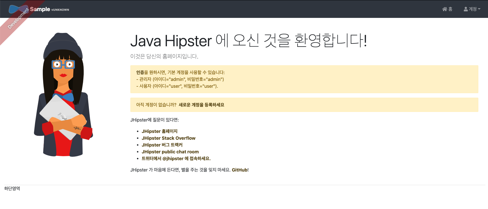

### 로그인전 메뉴 


### 로그인

- ID: admin
- PWD: admin 

위 정보로 로그인하자. 

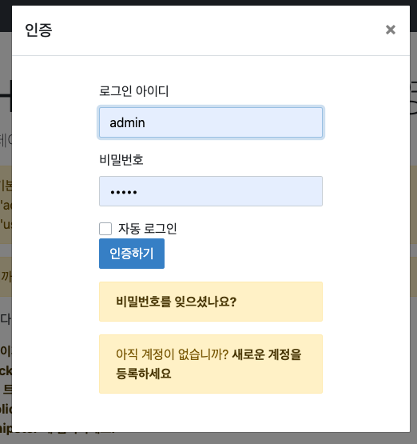

### 어드민 메뉴

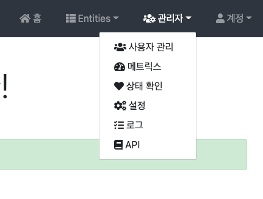

### Users

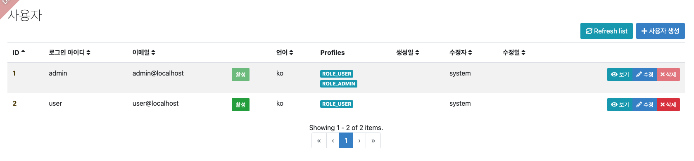

### Metrics

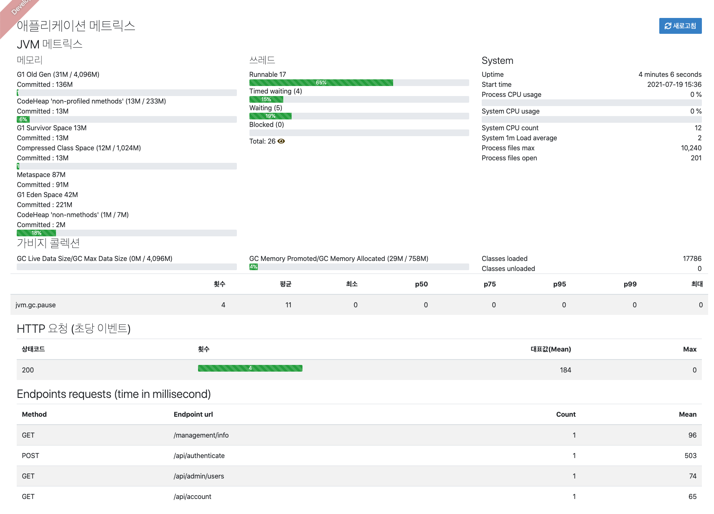

### Status Check

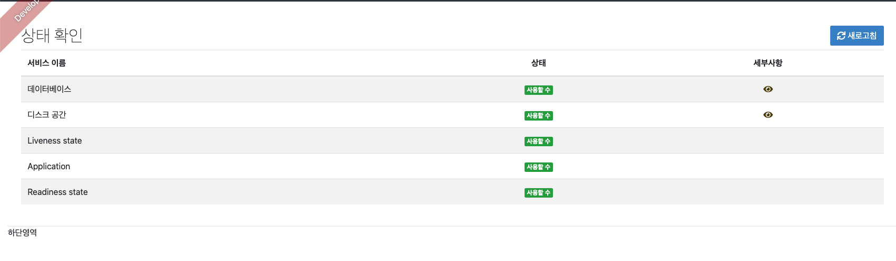

### Config View

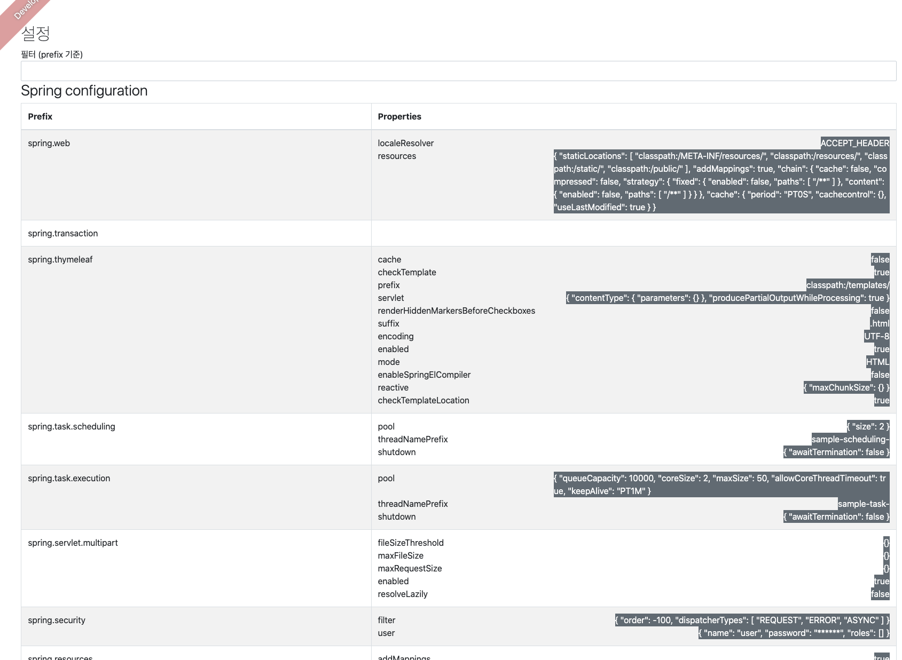

### Logging


### Swagger

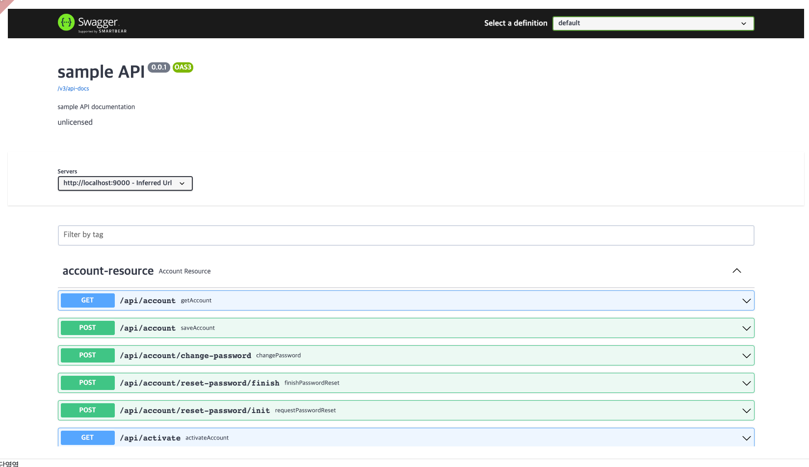

### Admin Menu for User

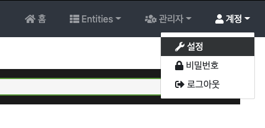

### Admin Modify

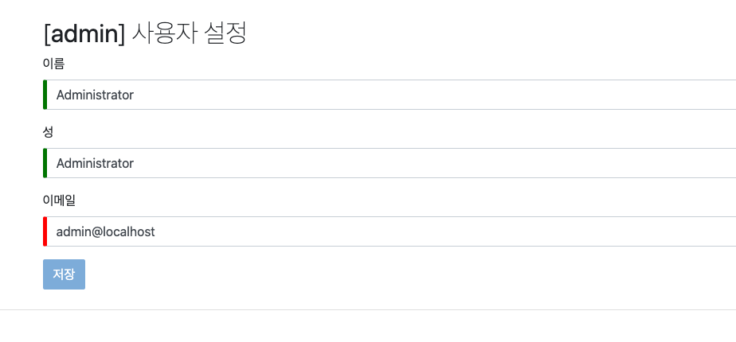

### Admin Password

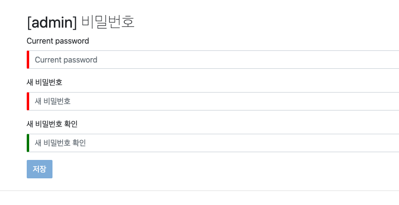

## Wrap Up

- JHipster 를 이용하여 웹 어플리케이션 개발을 위한 다양한 기술을 이용할 수 있다. 
- 간편하게 메유 방식을 통해서 어플리케이션에 따라 (모놀리식, 마이크로서비스 아키텍처, 기술스택) 등을 조정할 수 있다. 
- 초기 프레임워크 설치시 매우 빠르게 설치가 가능하다. 

위와 같은 장점이 있음을 확인했고, 매우 편리한 Admin UI 역시 확인할 수 있었다. 

그러나 JHipster은 다양한 기술 스택만큼 매워야 하는 기술이 많다. 

다음 아티클에서는 몇가지 주요 JHipster 프레임워크에 대해서 알아 볼 것이다. 


